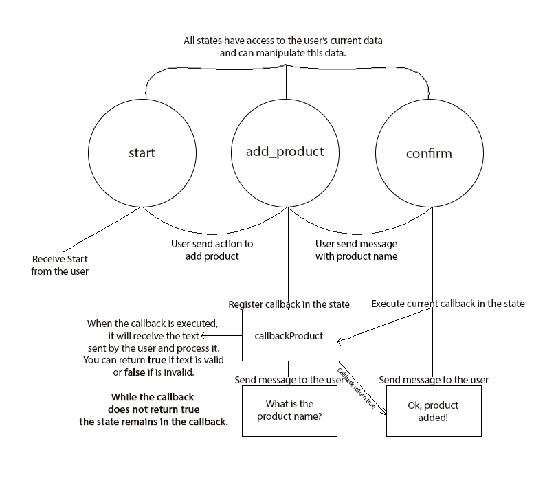

# Botstate

The easy way to manage bot states.

## Simple Bot Flow with Botstate


## Installation

botstate requires a Go version with [Modules](https://github.com/golang/go/wiki/Modules) support and uses import versioning. So please make sure to initialize a Go module before installing botstate:

```
go mod init
go get github.com/gucastiliao/botstate
```

Import:

```
import "github.com/gucastiliao/botstate"
```

## Manage state

To manage states, botstate have a default client that uses [go-redis](https://github.com/go-redis/redis), but you can make your own client to save state the way you prefer.

You need to initialize storage with your client.
This example is using [go-redis](https://github.com/go-redis/redis) with botstate.DefaultStorage:
```go
r := redis.NewClient(&redis.Options{
    Addr: mr.Addr(),
})

botstate.SetStorageClient(botstate.DefaultStorage(r))
```

If you have your own client:

```go
var myClient botstate.Storager

...

botstate.SetStorageClient(myClient)
```

## Simple Example

```go
package main

import (
	"fmt"

	"github.com/go-redis/redis/v7"
	"github.com/gucastiliao/botstate"
)

func main() {
	redis := redis.NewClient(&redis.Options{
		Addr:     fmt.Sprintf("%s:%s", "127.0.0.1", "6379"),
		Password: "",
	})

	botstate.SetStorageClient(
		botstate.DefaultStorage(redis),
	)

	states := []botstate.State{
		{
			Name:     "start",
			Executes: Start,
			Next:     "add_product",
		},
		{
			Name:     "add_product",
			Executes: AddProduct,
			Callback: CallbackAddProduct,
			Next:     "confirmation",
		},
		{
			Name:     "confirmation",
			Executes: Confirmation,
		},
	}

	bot := botstate.New(states)
	bot.Data.User(111)

	bot.ExecuteState("start")
	// This print Start...

	current, _ := bot.Data.GetCurrentState()
	// Current state now is -> add_product
	// Because value of State.Next

	bot.ExecuteState(current)
	// This print Add Product...

	current, _ = bot.Data.GetCurrentState()
	// Current state now is -> confirmation

	bot.ExecuteState(current)
	// This print Callback Add Product... and Confirmation ...
	// The callback is defined in the previous state
	// And in this execution is called
	// If the callback return true, the execution continue and call Confirmation method
}

// botstate.Bot have access to current user's data
// and can manipulate it
func Start(bot *botstate.Bot) bool {
	fmt.Println("Start...")
	return true
}

func AddProduct(bot *botstate.Bot) bool {
	fmt.Println("Add Product...")
	return true
}

func CallbackAddProduct(bot *botstate.Bot) bool {
	fmt.Println("Callback Add Product...")
	return true
}

func Confirmation(bot *botstate.Bot) bool {
	fmt.Println("Confirmation...")
    bot.Data.ResetAll()
	return true
}

```

## See more

- [Docs](https://pkg.go.dev/github.com/gucastiliao/botstate?tab=doc)